# GitHub Workflow CI/CD 項目

## 一、項目簡介
### 建立 GitHub Action CI/CD 和 Infra基礎設施 pipeline 工作流
1. CI/CD pipeline: 實踐從代碼提交合併、代碼自動化測試、打包鏡像、推送鏡像倉庫、服務部署，建立代碼持續集成/持續交付,部署管道pipeline
2. Infra基礎設施資源管理：使用 terraform 來創建管理基礎設施資源

## 二、項目背景
學習 CI/CD pipeline，以 GitHub Actions CI/CD 為實踐場景，建立從 CI/CD MVP 最小可行產品，實際演練和驗證 DevOps 交付流程及相關技術方案的可行性，並標準化 Pipeline、Workflow 工作流，從代碼自動測試集成到打包鏡像推送交付，為後續實際業務服務提供基礎方案，可將Github Runner概念帶到Jenkins Agent或Gitlab Runner

使用 Terraform 用IaC方式 (Infrastructure as Code) 對基礎設施進行規格和資源部署批量管理，本項目infra 以 AWS Cloud Provider為例，後續可針對不同基礎架構Provider供應商，GCP、阿里雲和K8s Provider等進行方案驗證演練

VM機器上的配置管理，使用Salt Master和Salt Minion架構，後續機器上的應用服務等可透過 Salt Master sls文件和設置自定義 salt grains 對指定salt minions目標節點Target管理，透過在salt master 執行 salt -G 命令，例如： `salt -G app:backend` 對特定應用服務`app:backend`進行配置批量下發等操作

## 三、項目架構
(使用 **draw.io** 畫圖展示)

### 1. 應用程序代碼交付 (使用 GitHub Workflow 搭建自動化pipeline)
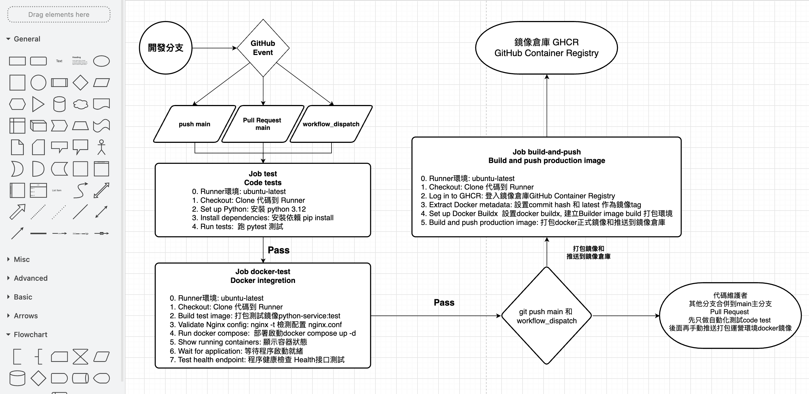

1. **Code Commit/Merge branch**: 開發提交代碼/合併分支，依據不同Github Event事件觸發GitHub Trigger
2. **Code tests**: 開發代碼自動化測試驗證 
3. **Docker integretion test**: 依據 **Dockerfile** 打包鏡像和鏡像部署測試 
4. **Build and push production image**: 正式環境鏡像打包和推送指定鏡像倉庫Registry，這邊推送到GHCR (GitHub Container Registry)

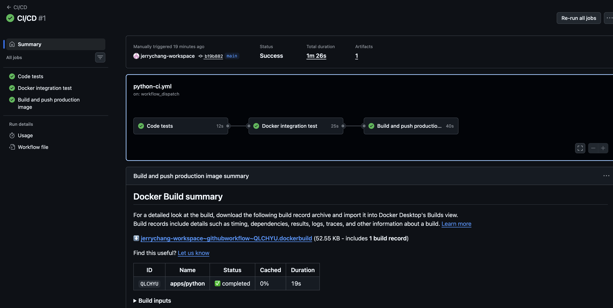

#### Code tests job 的 steps 步驟
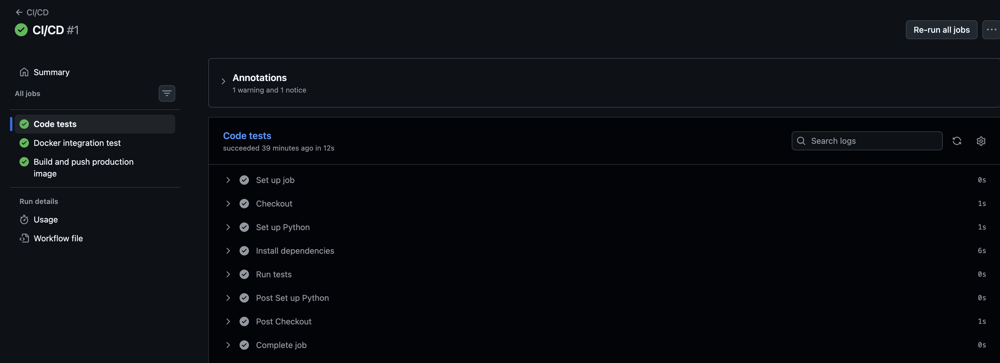

#### Docker integration test job 的 steps 步驟
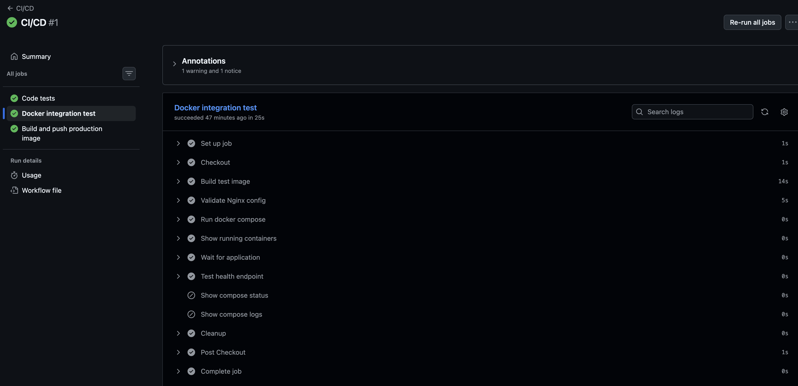

#### Build and push production image job 的 steps 步驟
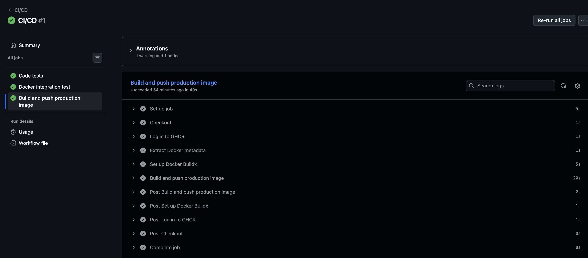

### 2. 基礎設施資源管理 (使用 Terraform 批量管理)
### AWS 網絡架構
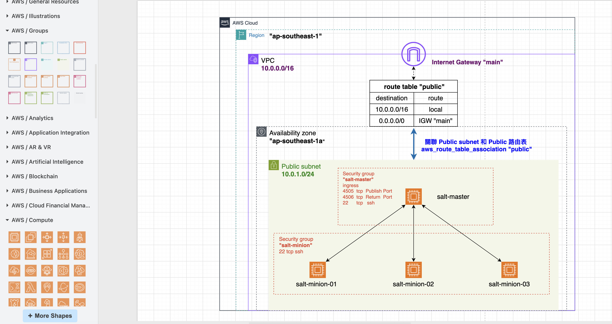

### 使用 GitHub OIDC + IAM Role 方案來調用AWS資源服務
- 解決 AWS Access Key 長期金鑰保存在第三方服務的外洩風險 : 防止 `AWS_ACCESS_KEY_ID ` 和 `AWS_SECRET_ACCESS_KEY` 外洩

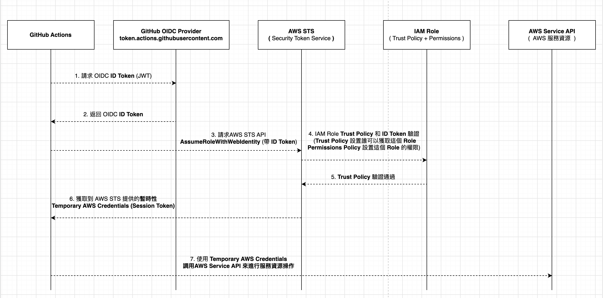

#### AWS IAM 設置 - 添加身份供應商 Identity providers
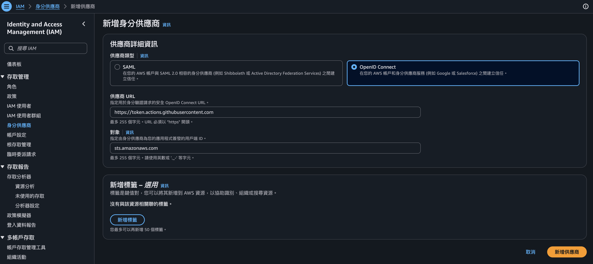
- 身份供應商 Identity providers：  
https://token.actions.githubusercontent.com

- 對象 Audience：  
sts.amazonaws.com

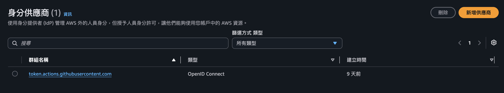

#### AWS IAM 設置 - 創建角色 IAM Role

**Trust Policy** : 設置誰可以獲取這個 Role
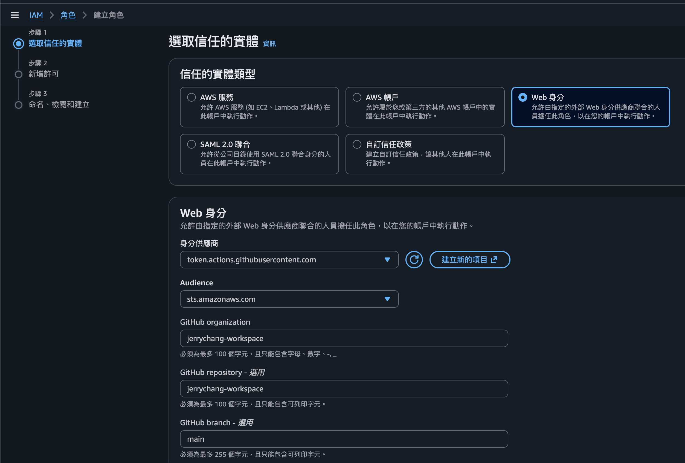

- 身份供應商 Identity providers：https://token.actions.githubusercontent.com

- 對象 Audience： sts.amazonaws.com

- GitHub organization : 填寫你的GitHub帳號

- GitHub repository - 選填 : 填寫指定倉庫項目

- GitHub branch - 選填 : 填寫指定分支

**Permissions Policy** : 設置這個 Role 的權限
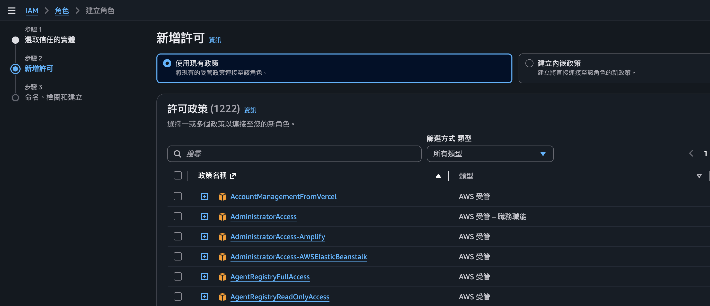

**角色命名** 
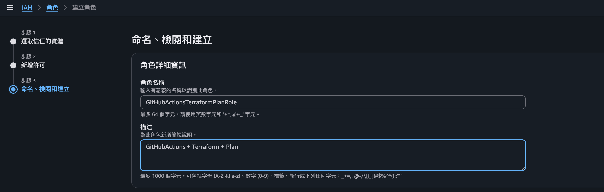

備注： 2026/07/15 創建之後的 Repository，Trust Policy 要寫成 Immutable format，需要添加 Owner ID (Organization ID) 和 Repository ID   

- Syntax: `repo:OWNER@OWNER-ID/REPO@REPO-ID:ref:refs/heads/BRANCH`  
- Previous format example: `repo:octo-org/octo-repo:ref:refs/heads/main`
- Immutable format example: `repo:octo-org@123456/octo-repo@456789:ref:refs/heads/main`

GitHub OIDC AWS 官方文檔：https://docs.github.com/en/actions/how-tos/secure-your-work/security-harden-deployments/oidc-in-aws   
GitHub OIDC官方文檔： https://docs.github.com/en/actions/reference/security/oidc

### 3. 應用服務配置管理下發 (使用 Salt 批量配置下發)

使用 salt 安裝 docker compose 等環境相關應用安裝包和啟動服務，salt的module "pkg" 的 function "installed" 來安裝包，使用salt的module "service" 的 function "running" 來啟動運行

## 四、GitHub Container Registry (GHCR) 鏡像倉庫
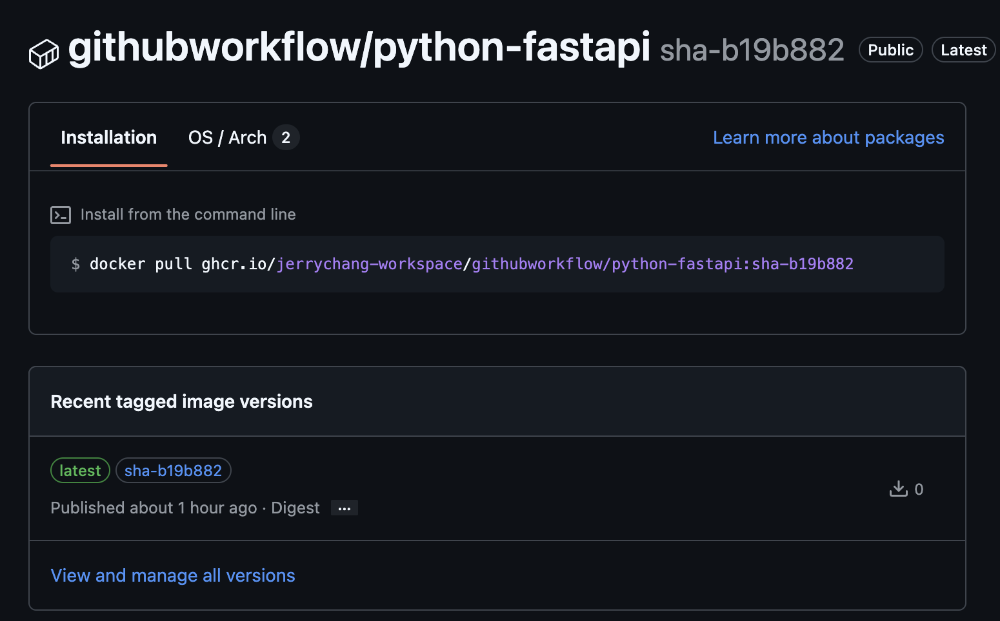

